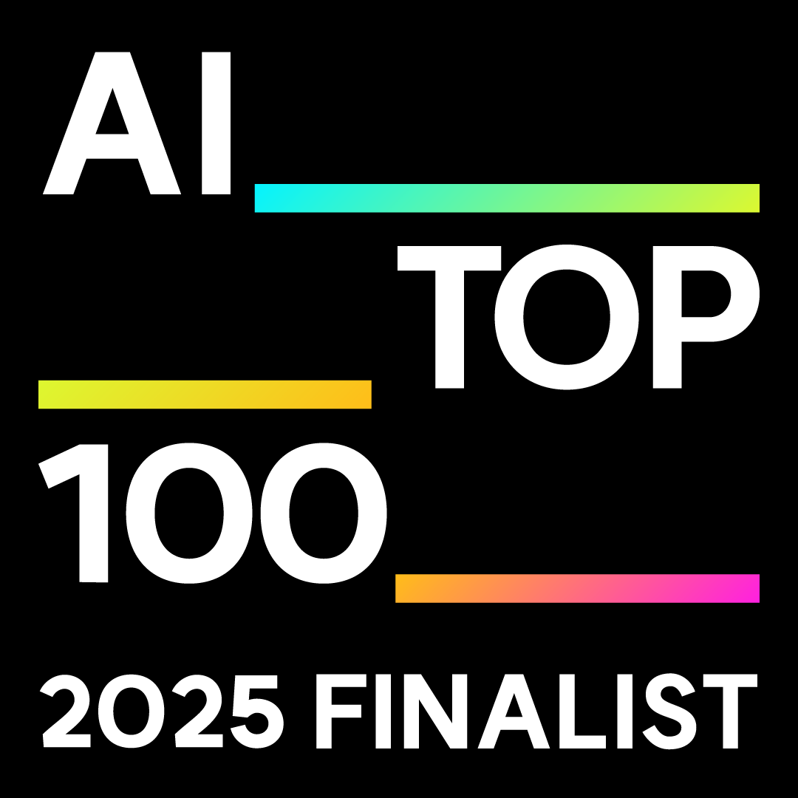

<div align="center">


<a href="https://readme-typing-svg.demolab.com?font=JetBrains+Mono&weight=600&size=22&duration=3200&pause=800&color=6DB33F&center=true&vCenter=true&width=820&lines=DX%EC%97%90%EC%84%9C+AX%EB%A1%9C+%EC%9B%8C%ED%81%AC%ED%94%8C%EB%A1%9C%EC%9A%B0%EB%A5%BC+%EB%8B%A4%EC%8B%9C+%EC%84%A4%EA%B3%84%ED%95%A9%EB%8B%88%EB%8B%A4;%EC%99%B8%EC%A3%BC+%EC%9B%B9%EC%95%B1%EA%B3%BC+%EA%B0%9C%EC%9D%B8+SaaS%EB%A5%BC+%ED%98%BC%EC%9E%90+%EB%A7%8C%EB%93%A4%EC%96%B4+%EC%B6%9C%EC%8B%9C%ED%95%A9%EB%8B%88%EB%8B%A4;Hermes+Agent+%2B+%EB%A1%9C%EC%BB%AC+GPU%EB%A1%9C+24%2F7+%EC%9E%90%EB%8F%99%ED%99%94+%EC%9D%B8%ED%94%84%EB%9D%BC%EB%A5%BC+%EC%9A%B4%EC%98%81%ED%95%A9%EB%8B%88%EB%8B%A4;AI%2FAX+%EC%82%AC%EB%82%B4+%EA%B0%95%EC%9D%98%EC%99%80+%EC%9B%8C%ED%81%AC%EC%88%8D%EB%8F%84+%EC%A7%84%ED%96%89%ED%95%A9%EB%8B%88%EB%8B%A4">
  
</a>

<br/>

<a href="https://brianimpact.notion.site/AI_TOP_100-FINALIST-2ed0e052072a80aeadedefff1f2ea6bd">
  
</a>

<br/><br/>


<br/>

<a href="https://baeksang.dev"></a>
<a href="https://baeksang.dev/ax"></a>
<a href="https://baeksang.dev/daily"></a>
<a href="https://devcom.kr"></a>
<a href="https://www.youtube.com/@Mrbaeksang95"></a>
<a href="mailto:contact@baeksang.dev"></a>

</div>

---

## 👋 About

> **외주 웹앱·개인 SaaS를 혼자 만들어 출시하는 풀스택 + AX 엔지니어, 그리고 AI/AX 강사.**
> Next.js · FastAPI · Spring Boot · KMP로 프론트·백·모바일·배포까지 한 사람이 책임지고, LLM을 **장난감이 아니라 제품**으로 붙입니다. 그 워크플로 자체를 AI로 다시 짭니다.

| 제공 | 내용 |
|------|------|
| 🧭 **AX 컨설팅** | 백상랩스 — DX→AX 진단·파일럿·풀세팅 · [상세](https://baeksang.dev/ax) |
| 🎤 **AI/AX 강사** | 사내 AI 도구 실무 강의 · 워크숍 · 사내 가이드 작성 (Claude · MCP · Agent · 프롬프트) |
| 🌐 **풀스택 웹** | Next.js · Spring Boot · FastAPI — DB·배포까지 |
| 🤖 **AI 제품** | OpenRouter · Spring AI · LangGraph · MCP · Agent · SSE |
| 📱 **모바일/데스크톱** | KMP · Compose · Tauri — Play 출시 2건 + 토스 미니앱 1건 |
| ⚙️ **이중 AI 하네스** | ECC 115 스킬 + Hermes Agent 자체 운영 |

---

## 🧭 AX 컨설팅 · 백상랩스

> **DX는 화면을 바꿨고, AX는 판단을 바꿉니다.**

| 단계 | 내용 |
|------|------|
| **01. 진단** | 1~2주 워크플로 분석 + AI 치환 우선순위 + ROI/보안/데이터 |
| **02. 파일럿** | 1~2개 흐름을 4~6주 안에 실제 돌아가는 AI 워크플로로 |
| **03. 풀세팅** | 조직 확장, 사용 가이드 + 보안 룰 + 평가 루프 + 운영 인계 |

**Anthropic Academy 18종 수료** _(2026-05)_ — AI Fluency · Claude · API · Agent/MCP 전 카테고리 (`AI Fluency: Framework & Foundations` 10/10)

📩 [contact@baeksang.dev](mailto:contact@baeksang.dev?subject=AX%20컨설팅%20문의) · 첫 30분 진단 무료

---

## 🎤 AI/AX 강의 · 워크숍

> **사내 AI 도구 사용법부터 워크플로 재설계까지 — 직접 만들면서 쓰는 사람이 가르칩니다.**

| 형태 | 내용 |
|------|------|
| **AI 도구 실무 강의** | Claude Code · Cursor · ChatGPT 실전 사용법, 프롬프트 설계, 함정 패턴 |
| **MCP · Agent 워크숍** | 사내 시스템 연결, Skill/Subagent 설계, 보안·평가 루프 |
| **사내 AI 가이드 작성** | 사용 룰 · 보안 룰 · 평가 기준 문서화, 팀별 적용 시나리오 |
| **DX→AX 마이그레이션** | 컨설팅 + 강의 패키지로 진행 가능 |

📩 강의·워크숍 문의: [contact@baeksang.dev](mailto:contact@baeksang.dev?subject=AI%2FAX%20강의%20문의)

---

## 🚀 주요 프로젝트

<details>
<summary><b>1. 사주박사 — AI 운세</b> · <code>토스 미니앱 + Google Play</code></summary>

<br/>

[](https://spring.io/)
[](https://kotlinlang.org/)
[](https://minion.toss.im/3tQu0ibn)

**토스 앱인토스 + Google Play 양쪽 출시한 AI 운세 미니앱**

- 🔮 5명의 사주박사 캐릭터 — 사주·타로·꿈해몽·궁합·연애운 크레딧 기반 해석
- 🤖 OpenRouter 멀티모델 — 유동 모델 선택으로 비용/성능 최적화
- 💰 RevenueCat 인앱결제 + AdMob 리워드 광고 + 크레딧 시스템
- 📱 [Play Store](https://play.google.com/store/apps/details?id=com.sajubaksa.android) · [Toss 미니앱](https://minion.toss.im/3tQu0ibn)

</details>

<details>
<summary><b>2. Memex — 한국어 회의·메모·인터뷰 작업 공간</b> · <code>memex.baeksang.dev</code></summary>

<br/>

[](https://go.dev/)
[](https://nextjs.org)
[](https://github.com/pgvector/pgvector)

**음성·텍스트 → 받아쓰기 + 핵심 정리 + 사람·주제 자동 연결 한 번에**

- 🎙️ faster-whisper 음성 인식 + 4-layer 자산(raw/processed/facts/embeddings)
- 🧠 지식 그래프 + 하이브리드 챗봇으로 "내가 알던 사람 누가 뭐 했더라" 자동 회상
- 🔐 음성 원본 24시간 자동 폐기, 워크스페이스 단위 격리

</details>

<details>
<summary><b>3. AskUp — Upstage Solar-Pro2 AI 챗봇</b> · <code>Upstage 외주 계약</code></summary>

<br/>

[](https://spring.io/)
[](https://spring.io/projects/spring-ai)
[]()

**Upstage 외주 계약으로 개발한 Solar-Pro2 기반 AI 챗봇** — Backend + KMP Mobile + Admin Dashboard

- 🧠 Spring AI + SSE 스트리밍, 파일 첨부 시 Upstage OCR 자동 처리
- 🗄️ PgVector 장기 기억 (Mem0 스타일 2단계 파이프라인)
- 📱 KMP Android/iOS 단일 코드베이스, Compose Multiplatform UI
- 🔐 28개 API · 53+ 테스트
- 🎥 [시연 영상](https://www.youtube.com/watch?v=4j4Pxz3KDT0)

</details>

<details>
<summary><b>4. 매일의 AI · 개발 다이제스트</b> · <code>baeksang.dev/daily</code></summary>

<br/>

[](https://nextjs.org)
[](https://bun.sh)
[](https://orm.drizzle.team)

**매일 08:00 KST에 AI·개발 뉴스를 자동 큐레이션해서 6 섹션으로 발행 + LinkedIn/Threads/FB 자동 포스팅**

- 🗂️ GitHub · HN · Reddit · arXiv · HF Daily · K-Startup · RSS 7개 소스 → 4-layer dedup
- 🤖 OpenRouter 멀티모델 분류 + 큐레이션 (structured outputs strict JSON Schema)
- 📡 [RSS](https://baeksang.dev/rss.xml) · [llms.txt](https://baeksang.dev/llms.txt) · LinkedIn 자동 발행 (210자 hook + CTA + 해시태그 피라미드)
- 🛡️ `/admin/run-pipeline` HMAC 서명 + Vercel ISR + Railway SIGTERM 30s graceful shutdown

</details>

<details>
<summary><b>5. Qnova — 학원 수업자료 AI 생성 SaaS</b></summary>

<br/>

[](https://fastapi.tiangolo.com/)
[](https://www.langchain.com/langgraph)

**강사용 수업자료 자동화 SaaS — PDF/DOCX/HWP 한 번 업로드로 수업 한 개가 완성**

- 📄 PDF · DOCX · HWP 교재 → LangGraph로 Question/Section 분석
- 🧠 Structured Output으로 단어 리스트 · 테스트 · 해설 · Snap Quiz 자동 생성
- 📤 PDF/DOCX 바로 익스포트, 강사 편집 없이 수업 투입 가능

</details>

<details>
<summary><b>6. 야무진 — 네이버 플레이스 랭킹 추적 + 시그널 대시보드</b></summary>

<br/>

[](https://nextjs.org)
[](https://fastapi.tiangolo.com/)

**광고 대행사 내부용 순위 추적 + 시그널 대시보드**

- ⏱️ 매일 13:30에 685건 키워드 병렬 수집 (adlog API)
- 🚨 임계값·급락·잔여일 시그널 자동 발행
- 📊 Railway 상시 배포, PostgreSQL 저장

</details>

<details>
<summary><b>7. 마인드톡 — AI 철학 상담 앱</b> · <code>Google Play 출시</code></summary>

<br/>

[](https://spring.io/)

**AI 철학자 캐릭터와 대화하는 상담 서비스** — 응답 112ms → 52ms (53% 개선), Redis 캐싱 + 토큰 회전, Google/Kakao OAuth, Play Store 심사 통과. [GitHub](https://github.com/Mrbaeksang/ai-counseling-backend)

</details>

<details>
<summary><b>8. devcom.kr — 개발자 커뮤니티</b> · <code>회원 1,000명 운영</code></summary>

<br/>

**실제 운영 중인 개발자 커뮤니티** — AI Q&A 시스템 (OpenRouter 통합 자동 코딩 답변), 이중 콘텐츠 구조 (승인제 메인 + 즉시 게시 커뮤니티), RBAC 권한 관리. [devcom.kr](https://devcom.kr)

</details>

<details>
<summary><b>9. PollDash — 실시간 투표 커뮤니티</b> · <code>라이브 서비스</code></summary>

<br/>

**투표 결과를 바 차트 레이스로 시각화** — Framer Motion 기반 10~30초 순위 변동, 8개 카테고리, 시간대별 랭킹, 비공개 투표(shareToken). [polldash.app](https://polldash.app)

</details>

---

## ⚙️ 이중 AI 하네스

> **"코딩은 Claude Code, 상시 운영은 Hermes Agent. 그 사이를 4종 훅이 받친다."**

| 영역 | 도구 | 역할 |
|------|------|------|
| 🟢 **세션형 코딩** | **ECC** (Everything Claude Code) | 16 플러그인 · 28 에이전트 · **115 스킬** · 59 커맨드, 한국어 풀로컬라이즈. 병렬 에이전트 + Planner→Generator→Evaluator 루프 |
| 🟣 **24/7 상시 운영** | [**Hermes Agent**](https://github.com/nousresearch/hermes-agent) | Telegram·Discord·Slack·WhatsApp·Email 한 게이트웨이. 로컬 Qwen 35B로 외부 API 의존 0 |
| 🔁 **인스팅트 학습 루프** | ECC 명령 체인 | `continuous-learning` → `eval-harness` → `evolve` → `harness-optimizer` |

<details>
<summary><b>🪝 매일 쓰는 4종 훅 — 토큰·컨텍스트가 새지 않게</b></summary>

<br/>

| 훅 | 어떤 손실을 막나 |
|----|------------------|
| **RTK** _(Rust Token Killer)_ | Claude Code 훅에 자동 wrapping된 CLI proxy. 일상 명령 출력을 모델 컨텍스트로 흘리기 전에 요약·필터링해서 **토큰 60~90% 절감** |
| **context-mode** | Bash·WebFetch·큰 JSON을 메모리에 흘리지 않고 샌드박스+FTS5 인덱스로 받음. `ctx_search`로 필요한 부분만 꺼냄. 14개 클라이언트 호환 |
| **graphify** | 코드·문서·이미지 폴더를 지식 그래프로 만들어 BFS·DFS·최단 경로 쿼리로 답. raw 파일 안 읽고 그래프 traversal |
| **Atrium** _(철학)_ | 외부 API = 비용·검열·지연·프라이버시 4종 묶음. 로컬 GPU에 모델 직접 띄워 MCP로 호출하면 그 묶음에서 풀려요 |

</details>

---

## 🤖 자동화 인프라

> **로컬 GPU + Hermes Agent + 카카오톡 채널 양방향 봇 = 카톡 한 줄로 캘린더 등록 · Gmail 분석 · 매일 아침 브리핑.**

```
[내 카톡] ─→ 카카오톡 채널 (백상랩스)
             └─→ 카카오 i Bot · Skill webhook (공인 도메인)
                  └─→ Hermes Agent (로컬 Qwen 35B-A3B)
                       ├─ Google Calendar 자동 등록
                       ├─ Gmail 모니터링 → 분석 → 카톡 답장
                       ├─ 자연어 cron ("매일 아침 7시 브리핑")
                       └─ 5s 내 동기 / 초과 시 callbackUrl 비동기
```

<details>
<summary><b>인프라 구성 보기</b></summary>

<br/>

| 레이어 | 구성 |
|--------|------|
| **메시지 채널** | 카카오톡 채널 (사업자 백상랩스) + 카카오 i 오픈빌더 Skill 서버 |
| **에이전트 코어** | Hermes Agent (Nous Research / MIT) · Persistent memory · Skills Hub · 자연어 cron |
| **추론 엔진** | 로컬 Qwen3.6 35B-A3B Uncensored (`:8080`) + Qwen3-Embedding-8B (`:8082`) |
| **외부 노출** | Tailscale Funnel / Cloudflare Tunnel로 로컬 endpoint를 공인 도메인에 매핑 |
| **통합 스킬** | Gmail · Google Calendar · Linear · arXiv · 매일의 AI 발행 |

</details>

---

## 🤝 오픈소스

| 프로젝트 | 설명 |
|----------|------|
| [**Korea Stock Analyzer MCP**](https://github.com/Mrbaeksang/korea-stock-analyzer-mcp) 🏆 | Anthropic MCP 공식 서버 등재 — 6대 투자대가 전략 분석 |
| [**My Site Template**](https://github.com/Mrbaeksang/my-site-template) ⭐ 86+ | Next.js + TS 웹사이트 스타터 |
| [**computer-use-mcp**](https://github.com/Mrbaeksang/computer-use-mcp) | macOS 제어 MCP — Rust NAPI in-process |
| [**spring-ai-weather-tool**](https://github.com/Mrbaeksang/spring-ai-weather-tool) | Spring AI 1.0.1 + Groq · `@Tool` 자동 호출 |
| [**md-converter-korean**](https://github.com/Mrbaeksang/md-converter-korean) | 한국어 마크다운 → HTML·PDF·DOCX·PPT |

---

## 🛠️ 기술 스택

<div align="center">


</div>

<details>
<summary><b>분류별 상세</b></summary>

<br/>

| 분류 | 기술 |
|------|------|
| **Backend** | Kotlin · Java · Spring Boot · Spring AI · JPA · Kotlin JDSL · Python · FastAPI · SQLAlchemy 2.0 async · Go · Gin |
| **AI / LLM** | OpenRouter · Spring AI · LangGraph · MCP · SSE Streaming · Structured Output · PgVector · 로컬 추론(llama.cpp · vLLM · SGLang) |
| **Mobile** | Kotlin Multiplatform · Compose Multiplatform · Voyager · Koin · Ktor Client |
| **Frontend** | Next.js 16 · React 19 · TypeScript · Tailwind v4 · shadcn/ui · TanStack Query · Zustand |
| **Animation/3D** | GSAP · Framer Motion · Three.js · React Three Fiber · Lenis |
| **Database** | PostgreSQL · PgVector · Redis · SQLite · Drizzle |
| **DevOps** | Docker · GitHub Actions · Vercel · Railway · Tailscale · Cloudflare Tunnel |
| **Auth** | OAuth 2.0 (Google · Apple · Kakao · LinkedIn) · JWT · 토큰 회전 |

</details>

---

## 🏆 주요 성과

- 🏆 **2025 AI_TOP_100 FINALIST** — 카카오·브라이언임팩트·카카오임팩트
- 🎓 **Anthropic Academy 18종 수료** (1종 10/10 만점)
- 📋 **Upstage 외주 계약** — AskUp Solar-Pro2
- 📱 **Google Play 출시 2건** + 토스 미니앱 1건
- 🌏 **Anthropic MCP 공식 서버 등재** — Korea Stock Analyzer
- 👥 **devcom.kr 1,000명 운영** · ⭐ **My Site Template 86+ Stars**
- 🏢 **백상랩스 사업자 등록** — AX 컨설팅·강의 정식 운영

---

<div align="center">

<picture>
  <source media="(prefers-color-scheme: dark)" srcset="https://raw.githubusercontent.com/Mrbaeksang/Mrbaeksang/output/github-snake-dark.svg" />
  
</picture>


<picture>
  <source media="(prefers-color-scheme: dark)" srcset="https://raw.githubusercontent.com/Mrbaeksang/Mrbaeksang/output/github-stats-dark.svg" />
  
</picture>

<br/>

### 📫 Contact

<a href="https://baeksang.dev"></a>
<a href="https://baeksang.dev/ax"></a>
<a href="mailto:contact@baeksang.dev"></a>
<a href="https://github.com/Mrbaeksang"></a>
<a href="https://www.youtube.com/@Mrbaeksang95"></a>

</div>


