<picture>
<source media="(prefers-color-scheme: dark) and (max-width: 600px)" srcset="assets/terminal/classic-mobile-dark.png">
<source media="(prefers-color-scheme: light) and (max-width: 600px)" srcset="assets/terminal/classic-mobile-light.png">
<source media="(prefers-color-scheme: dark)" srcset="assets/terminal/classic-desktop-dark.png">
<source media="(prefers-color-scheme: light)" srcset="assets/terminal/classic-desktop-light.png">
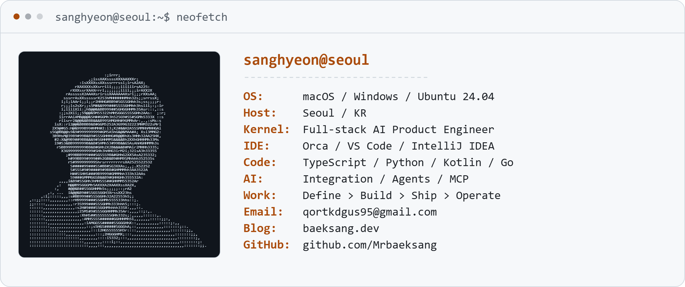
</picture>

# 백상현
**문제를 제품으로 만들고, 출시 후 운영까지 책임지는 엔지니어.**

문제 정의부터 웹·앱·백엔드 구현, AI·외부 도구 연동, 배포와 운영까지 이어갑니다. 직접 출시한 제품과 기업 프로젝트에서 사용자 경험과 안정적인 실행 흐름을 함께 설계합니다.

[프로젝트](https://baeksang.dev/work) · [개발 철학](https://baeksang.dev/harness) · [글](https://baeksang.dev/notes) · [이메일](mailto:qortkdgus95@gmail.com)

<table>
<tr>
<td width="24%" align="center">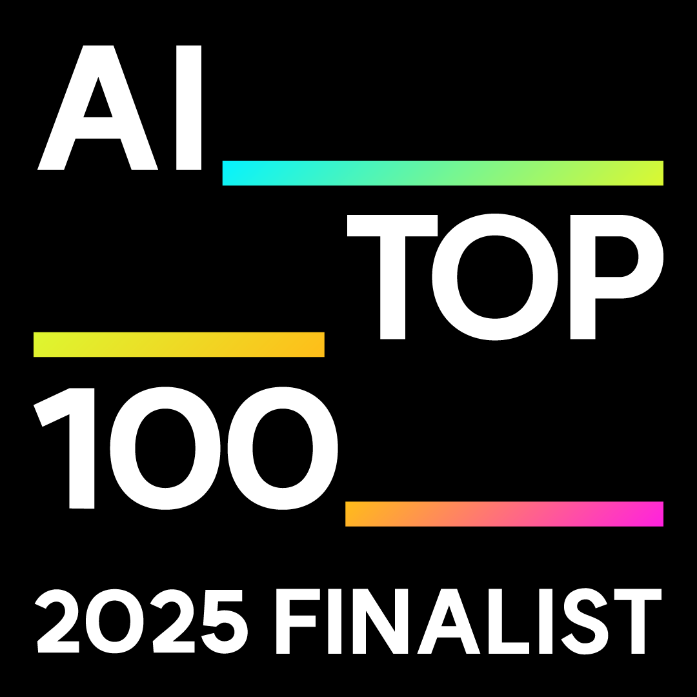</td>
<td>
<strong>2025 AI_TOP_100 · Finalist</strong> · 본선 진출 
<strong>APEX Expert AI · 파일럿 44명 중 3위</strong> 
88/100점 · 실기 55/60 · AI 활용 10/10 (2026.08) 
<strong>Upstage Solar Agent Partner Program</strong> 
Stage 1 선정 (2026.07)
</td>
</tr>
</table>

## 제품 개발과 AI를 함께 연결한 경험

### 마드라스체크 · Flow AI에서 제품 운영까지
**2026.04–현재 · AI사업개발실 · 책임**

**Flow AI — AI 기능을 업무 흐름과 제품으로 연결**
- **도구 호출 → 결과 검증.** Workflow Agent의 **계획 → 도구 실행 → 결과 검증 → 실패 시 재계획** 흐름을 구현했습니다.
- **개발 → 검증 자동화.** QA 이슈 대응 Agent와 **Playwright 테스트**로 화면 겹침·상호작용 회귀를 확인하는 흐름을 개발했습니다.
- **API 제약 → 자체 모델 서빙.** 외부 AI API 사용이 제한된 고객을 위해 Qwen·Gemma 계열을 vLLM으로 서빙하고, 양자화 전후 응답 속도와 품질을 비교했습니다.

<strong>같은 회사에서: OKR SaaS · 자발적으로 만든 사내 업무 솔루션</strong>

**OKR SaaS**를 기획부터 프론트엔드·백엔드·DB·배포까지 단독 개발·출시했습니다. 유료 고객이 사용하는 제품의 목표 계층·사용자별 접근 권한과 변경·삭제 영향을 설계하고, 배포 시 기존 연결 정리와 고객 피드백 반영까지 담당했습니다.

교육용 Excel 요청을 일정·교육생·수강 현황 관리 문제로 재정의해 담당자가 쓰는 솔루션으로 만들었습니다. 일일 Excel 스캔과 사내 챗봇을 연결한 지출결의 기한 알림도 운영합니다.

AI사업개발실에서 분기 혁신상을 받았습니다. **마드라스체크의 Flow Repattern은 2026 국가 AI 대상 서울특별시장상을 수상했습니다.** 이 항목은 회사·제품의 성과입니다. [공개 보도](https://zdnet.co.kr/view/?no=20260928113805)

### 기업 의뢰 · AI 경험을 안정적인 실행으로

**AskUp · Upstage 의뢰** 2025.11–2026.02  
KMP 앱·Spring Boot 백엔드·관리자 화면을 개발하고 **SSE 스트리밍, OCR 문서 처리, pgvector 기반 대화 기억**을 연결했습니다. 네트워크 chunk 경계에서 JSON이 잘리는 문제는 **완전한 SSE 줄을 재조립한 뒤 변환**하도록 해결했습니다.  
[공개 시연](https://www.youtube.com/watch?v=4j4Pxz3KDT0) · [프로젝트 기록](https://baeksang.dev/work/askup)

**Timely AI MCP Hub · 전체 설계·개발·소스 전달** 2026.04–2026.06  
외부 업무 도구를 연결하고, 실행 결과에 따라 다음 Tool을 선택하는 Agent·병렬 실행·상태 스트리밍·예약·알림을 구현했습니다. **저장된 도구명과 인자는 코드가 직접 실행**하고, 반복 실패한 예약은 자동 비활성화했습니다.

예약 실행에서 LLM과 코드의 역할을 나눈 판단

브리핑 누락과 도구의 조기 종료·반복 호출을 고객과 검토했습니다. 자연어로 예약을 등록하는 과정과 확정된 작업 실행을 분리하고, LLM에는 결과 취합을 맡기는 방안을 **제안**했습니다. 실제 구현에서는 저장된 도구명·인자를 코드로 실행하고 실행 이력·실패 상태를 기록했습니다. 제안한 범위와 구현한 범위를 구분합니다.

**Qnova · 교재 기반 학습자료 생성 서비스 전체 개발** 2026.02–2026.06  
업로드 → 생성 → 검토·수정 → PDF·DOCX 출력까지 구현했습니다. 긴 AI 작업은 **작업 ID를 즉시 반환하고 DB에 상태·진행률·결과를 저장**해 재접속 후에도 조회하도록 구성했습니다. 서버 재시작 뒤 남은 실행 중 작업은 실패 상태로 정리했습니다.  
[서비스](https://qnova.co.kr)

## 직접 출시하고 운영하는 제품
<picture>
<source media="(prefers-color-scheme: dark)" srcset="assets/ai/saju-dark.png">
<source media="(prefers-color-scheme: light)" srcset="assets/ai/saju-light.png">
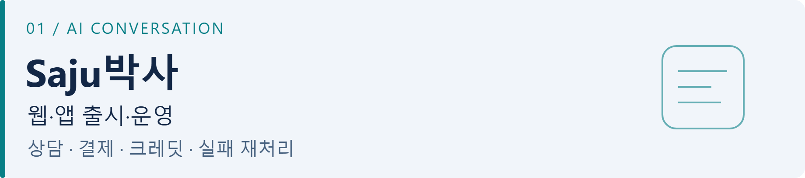
</picture>

### [Saju박사](https://play.google.com/store/apps/details?id=com.sajubaksa.android)
**웹·앱 출시·운영**  
웹·모바일·백엔드를 개발하고 AI 상담, 대화 저장, 크레딧 과금·인앱결제를 연결했습니다. 결제 Webhook의 처리 상태를 원장에 남기고, 중복 전달과 내부 재시도를 분리해 실패 이벤트를 재처리합니다.

실제 공개 앱 화면

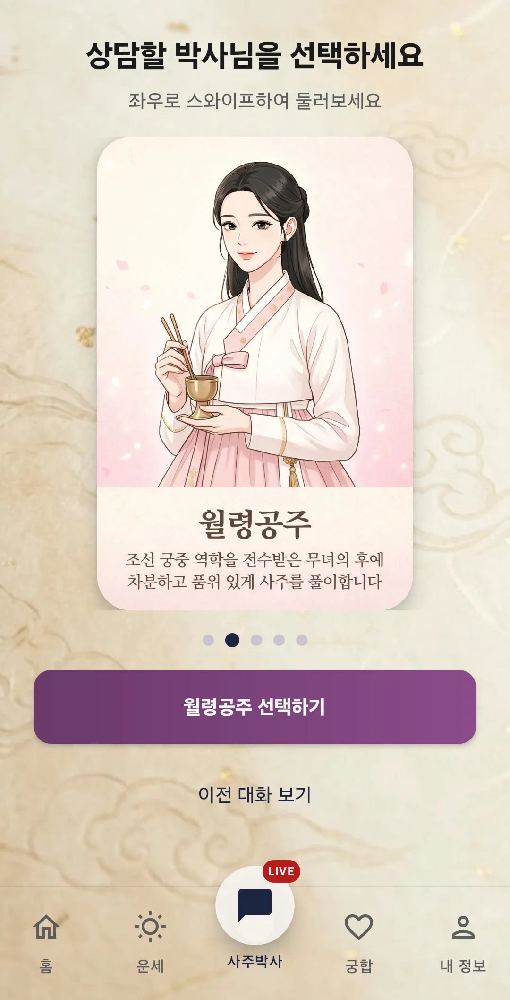

공개된 제품 소개 화면입니다. [출시 회고](https://baeksang.dev/notes/토스-미니앱-google-play-동시-출시-회고-사주박사)

<picture>
<source media="(prefers-color-scheme: dark)" srcset="assets/ai/daily-dark.png">
<source media="(prefers-color-scheme: light)" srcset="assets/ai/daily-light.png">
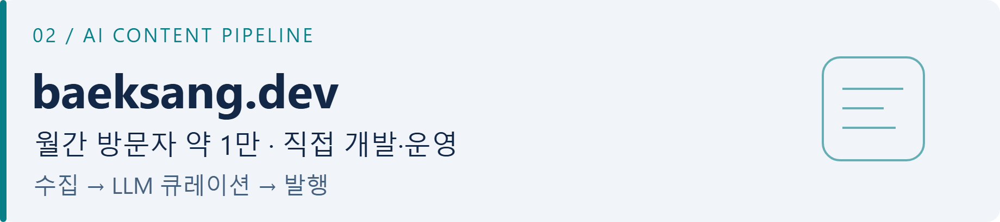
</picture>

### [baeksang.dev](https://baeksang.dev)
**월간 방문자 약 1만 · AI 콘텐츠 파이프라인**  
Vercel Analytics 방문자 기준 · 2026.10 확인  
수집·중복 제거·LLM 큐레이션·발행을 자동화했습니다. 입력 해시와 체크포인트로 성공한 단계의 결과를 재사용해 **실패 지점부터 재개**하고, OpenRouter 429·503·timeout에 재시도 정책을 적용했습니다. 독자의 요청을 Notes와 뉴스레터로 연결해 운영합니다.

실제 공개 웹 화면

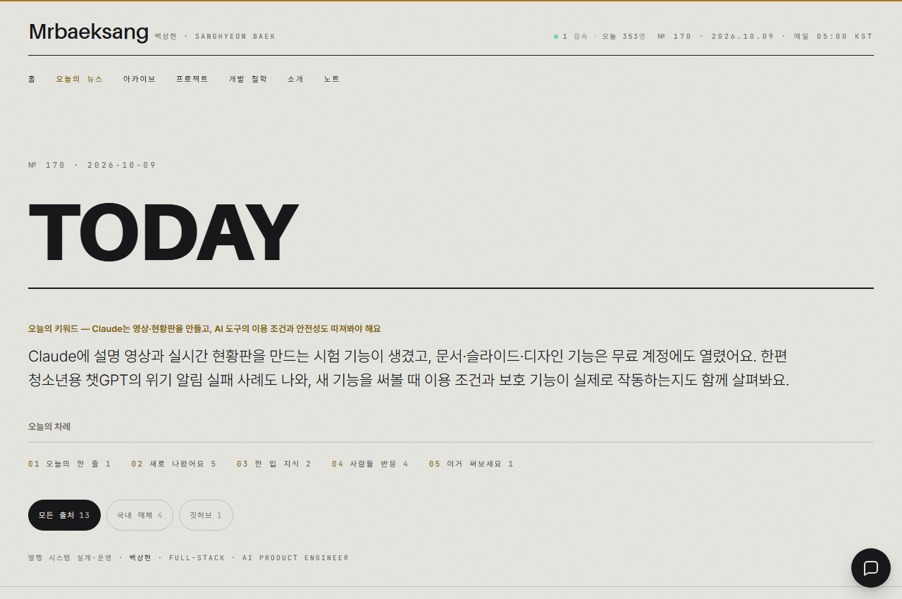

[AI 브리핑](https://baeksang.dev/daily) · [파이프라인 개발 기록](https://baeksang.dev/notes/매일-아침-8시-ai가-개발-뉴스를-자동-큐레이션하기까지)

<picture>
<source media="(prefers-color-scheme: dark)" srcset="assets/ai/deepcloak-dark.png">
<source media="(prefers-color-scheme: light)" srcset="assets/ai/deepcloak-light.png">
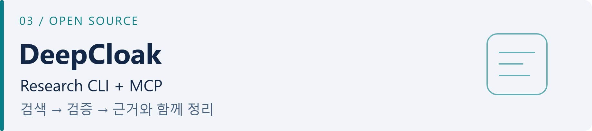
</picture>

### [DeepCloak](https://github.com/Mrbaeksang/deepcloak)
**Python CLI + MCP · 공개 소스와 실행 데모**  
리서치 엔진을 CLI와 MCP로 제공하고, 정보 검증과 근거 정리를 구현했습니다.

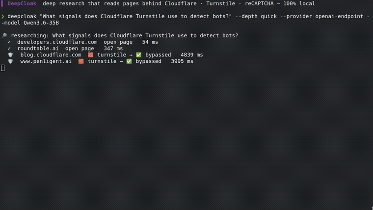

공개 저장소의 실제 실행 데모입니다.

**함께 공개한 코드**  
[**Korea Stock Analyzer MCP**](https://github.com/Mrbaeksang/korea-stock-analyzer-mcp) · DART 공시·KRX 시세 조회·분석  
[**My Site Template**](https://github.com/Mrbaeksang/my-site-template) · 화면에서 내용을 편집하는 Next.js 포트폴리오 템플릿

## 기술 · 사용자 화면부터 서비스 운영까지

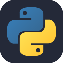

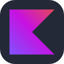
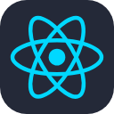

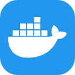

**웹·모바일** · Next.js/React · Kotlin Multiplatform/Compose  
**백엔드** · Spring Boot · NestJS · Hono/Bun · FastAPI · Go  
**데이터·운영** · PostgreSQL/pgvector · Redis · SQLite · Docker · AWS · Railway · Vercel
**AI·Agent** · MCP · LangGraph · Spring AI · OpenRouter   · vLLM

교육 · 자격

Anthropic Academy 18개 수료 · SQLD · TOEIC 815

